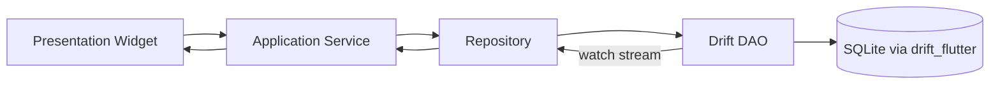

# Home

Welcome to the **Enjoy Player** wiki — a cross-platform language-learning media player built with Flutter.

Enjoy Player is a language-learning companion that plays local audio/video files, YouTube videos, and provides interactive transcripts, dictionary lookup, vocabulary SRS review, and shadow-reading (echo) practice — all with optional cloud sync and AI-powered transcript/explanations. Supported platforms: **Android, iOS, macOS, Windows, Linux**. Flutter web is not supported.

Current version: **0.7.2+6** ([pubspec.yaml](https://github.com/baizhiheizi/enjoy_player/blob/main/pubspec.yaml)).

## Quick Links

- [[Getting Started]] — setup, prerequisites, run, verify
- [[Architecture]] — feature-first layout, data flow, routing
- [[Player]] — media_kit engine, YouTube via WebView, transport bar
- [[Transcripts]] — SRT/VTT, YouTube captions, dictionary lookup
- [[Echo Mode]] — line-bounded shadow-reading practice
- [[Library]] — local media, cloud index, unified navigation
- [[AI and Lookup]] — AI SDKs, BYOK providers, inline dictionary
- [[Persistence]] — Drift schema, migrations, recovery
- [[Release and CI]] — build, sign, distribute per platform

## Tech Stack

- **Playback**: [media_kit](https://pub.dev/packages/media_kit) (+ `media_kit_video`, `media_kit_libs_video`) for local files/URLs — one single `Player` instance owned by `MediaKitPlayerEngine`/`PlayerController`
- **State**: [Riverpod 3](https://pub.dev/packages/flutter_riverpod) + `riverpod_annotation` codegen
- **Persistence**: [Drift](https://pub.dev/packages/drift) + `drift_flutter` + native SQLite
- **YouTube**: `flutter_inappwebview` (separate from media_kit, ADR-0015)
- **Navigation**: `go_router` with `ShellRoute` for persistent mini player
- **AI SDKs**: `ai_sdk_dart`, `ai_sdk_openai`, `ai_sdk_anthropic`, `ai_sdk_google` with BYOK provider settings (ADR-0033)
- **Auth**: `google_sign_in`, `sign_in_with_apple`, custom-scheme PKCE callback (ADR-0027, ADR-0034)
- **Logging**: `package:logging` via `logNamed()` wrapper — no `print()`

## Status

Enjoy Player is an MVP focused on local-first audio/video playback with interactive transcripts, YouTube import, shadow reading, vocabulary learning, and optional cloud metadata sync. The project follows a **login-only access** model (ADR-0031), a **feature-first architecture** (ADR-0004), and **per-user SQLite isolation** (ADR-0012). See [AGENTS.md](https://github.com/baizhiheizi/enjoy_player/blob/main/AGENTS.md) for contributor rules and quality gates.

---

# Getting Started

Setup and first-run workflow for contributors.

## Prerequisites

- Flutter SDK (stable, 3.x) — version pinned in [`.github/flutter-version`](https://github.com/baizhiheizi/enjoy_player/blob/main/.github/flutter-version)
- Dart ^3.12 (matches `pubspec.yaml`)
- **Apple (iOS + macOS)**: Xcode, CocoaPods, Apple Developer Program access for team **`46X685R747`**. See [packaging.md](https://github.com/baizhiheizi/enjoy_player/blob/main/docs/packaging.md#one-time-setup) for signing, TestFlight, and notarization.
- **macOS desktop**: [Homebrew](https://brew.sh) plus FFmpeg kit deps — `brew bundle install --file=macos/Brewfile`
- **Windows desktop**: [NuGet CLI](https://learn.microsoft.com/en-us/nuget/install-nuget-client-tools?tabs=windows#nugetexe-cli) on your `PATH`. Also FFmpeg: run `pwsh windows/scripts/fetch_ffmpeg.ps1` before release builds.
- **Linux desktop**: Install packages — `sudo apt-get install -y clang cmake curl git ninja-build pkg-config xz-utils zip libgtk-3-dev liblzma-dev libsqlite3-dev ffmpeg`

## Install

```bash
flutter pub get
dart run build_runner build   # after changing Drift / Riverpod annotations
```

### App icon & logo assets

The in-app logo uses `assets/logo-light.svg`. Generate launcher icons from a raster export:

```bash
npm install --prefix tool
node tool/svg_to_png.mjs           # writes assets/logo.png from the SVG
dart run flutter_launcher_icons    # uses flutter_launcher_icons.yaml
```

## Run

```bash
flutter run
```

**Android** builds use `store` / `direct` product flavors (ADR-0023). Plain `flutter run` uses the default `store` flavor. To test sideload/OTA behavior locally:

```bash
flutter run --flavor direct --dart-define=DISTRIBUTION_CHANNEL=direct
```

If install fails with `INSTALL_FAILED_VERSION_DOWNGRADE`, uninstall the existing release build first. On some OEMs (e.g. Xiaomi), enable **Install via USB** in Developer options if you see `INSTALL_FAILED_USER_RESTRICTED`.

## Verify

Install git hooks once per clone so pushes cannot skip the format/codegen gates:

```bash
git config core.hooksPath .githooks
```

Then run the shared gate script:

```bash
bash .github/scripts/validate_ci_gates.sh        # format + codegen drift
bash .github/scripts/validate_ci_gates.sh --all  # + analyze + test
```

Or individually:

```bash
flutter analyze
flutter test
bash .github/scripts/check_dart_format.sh
bash .github/scripts/check_codegen_drift.sh
```

---

# Architecture

Top-level system design.

The project follows a **feature-first** layout under `lib/features/<feature>/{data,domain,application,presentation}` with shared capabilities in `lib/core` (logging, routing, theme, errors, recovery, riverpod helpers, audio, platform) and `lib/data` (Drift database, API layer). Presentation code is UI-focused, domain models stay free of Flutter widget concerns, and persistence flows through Drift DAOs backed by `AppDatabase`. Riverpod providers and notifiers are the standard orchestration mechanism.

See [docs/architecture.md](https://github.com/baizhiheizi/enjoy_player/blob/main/docs/architecture.md) for the full reference.

## Module Layout

```
lib/
├── core/              # Shared infrastructure
│   ├── application/   # App-wide providers, language catalog, routing
│   ├── audio/         # Recording preview, WAV utilities
│   ├── cache/         # LRU store (L1Store)
│   ├── diagnostics/   # Logging, export, verbose diagnostics
│   ├── errors/        # AppFailure hierarchy
│   ├── ids/           # Enjoy ID generation
│   ├── interaction/   # Haptics, EnjoyTappable, drag scroll
│   ├── json/          # JSON casting, LLM parsing
│   ├── layout/        # Page kinds, constrained viewport
│   ├── logging/       # logNamed, file sink, redaction
│   ├── notices/       # AppNotice, bottom inset
│   ├── platform/      # Device form factor, platform checks
│   ├── presentation/  # LoadingIcon, SectionLabel, language labels
│   ├── recovery/      # DB recovery surface, error widget
│   ├── release/       # Distribution channel
│   ├── riverpod/      # AsyncValue extensions
│   ├── routing/       # GoRouter, app_router
│   ├── theme/         # EnjoyTheme, widgets, tokens
│   └── utils/         # Stream distinct, collections, sliver key index
├── data/              # Data layer
│   ├── api/           # ApiClient, RestApi base, services
│   └── db/            # AppDatabase, DAOs, tables, migrations
└── features/          # Feature modules
    ├── ai/
    ├── auth/
    ├── cloud/
    ├── community/
    ├── craft/
    ├── credits/
    ├── discover/
    ├── library/
    ├── lookup/
    ├── player/
    ├── settings/
    ├── sync/
    ├── transcript/
    ├── vocabulary/
    └── youtube/
```

Each feature follows the clean-architecture-inspired split: `data/` (repositories, DTOs), `domain/` (entities, value objects), `application/` (Riverpod notifiers, services), `presentation/` (widgets, screens). See ADR-0004 for the layout rationale and [[Conventions]] for naming rules.

## State Management

Riverpod 3 (`ConsumerWidget`/`ConsumerStatefulWidget`, `@riverpod`/`@Riverpod` codegen) is the single-source-of-truth for app state. Long-lived globals use `@Riverpod(keepAlive: true)`. Notifiers over mutable singletons. Avoid circular dependencies — UI sync widgets listen to `Player` streams instead of `PlayerController` calling `PlayerUi` directly. See ADR-0001.

## Data Flow

```
UI[Presentation Widget] --> App[Application Notifier/Provider]
App --> Repo[Repository]
Repo --> DAO[Drift DAO]
DAO --> DB[(SQLite via drift_flutter)]
DAO -->|watch stream| Repo --> App --> UI
```



Drift `watchX` queries emit fresh lists on every write to underlying tables. The shared `StreamDistinctExt.distinctBy<T>` extension collapses no-op emissions before they reach listeners. See [[Conventions#Stream dedupe]] for the pattern.

## Riverpod codegen

After schema or `@riverpod`/`@Riverpod`/Freezed/Drift annotation changes, regenerate **and commit** the outputs:

```bash
dart run build_runner build
bash .github/scripts/check_codegen_drift.sh --fix
```

Never hand-edit `*.g.dart`/`*.freezed.dart`.

## Manual providers

`libraryMediaProvider` is a hand-written `StreamProvider` because `riverpod_generator` + Drift row types hit an `InvalidTypeException` in codegen — documented in case more stream providers need the same workaround.

---

# Player

The media playback engine.

Uses `media_kit` exclusive for local/URL decode paths (ADR-0003). A single `Player` instance is owned by `MediaKitPlayerEngine` or `PlayerController` — no other code may instantiate `Player()` (ADR-0015). YouTube uses a separate `flutter_inappwebview` WebView engine, not media_kit.

## Engine

- **[`MediaKitPlayerEngine`](https://github.com/baizhiheizi/enjoy_player/blob/main/lib/features/player/application/player_engine.dart)** — media_kit binding for local files, network URLs, and streamable sources
- **[`PlayerController`](https://github.com/baizhiheizi/enjoy_player/blob/main/lib/features/player/application/player_controller.dart)** — orchestrates play, pause, seek, position tracking, and engine lifecycle
- **Teardown**: disposal is reentrancy-guarded and the teardown future is captured/observable to reduce the latent double-mpv race on `ref.invalidate`
- **Permanent surface host** ([ADR-0057](https://github.com/baizhiheizi/enjoy_player/blob/main/docs/decisions/0057-permanent-player-surface-host.md)): `RootShell` mounts one permanent `PlayerSurfaceHost` — the sole owner of `buildVideoStage()`, keyed by engine identity. Viewports register targets via `playerSurfaceRegistryProvider`.

## YouTube Playback

YouTube watch pages are loaded in a `flutter_inappwebview` WebView (ADR-0015). `mediaUrl` encodes the YouTube watch-page URL; the app does not use media_kit for YouTube. The WebView is mounted inside the same permanent surface host. Playback stays muted until the authoritative `playing` event settles — rejected `play()` promises are captured by `YouTube*` diagnostic loggers. Google sign-in navigations within the YouTube WebView are blocked (ADR-0025).

## Transport Bar

The `GlobalTransportBar` spans the bottom when a playback session exists. It is always-mounted and uses `Stream.distinctBy` to avoid rebuilds on no-op Drift ticks. The `transport_cc_fullscreen` CC indicator signals active subtitles. On desktop, keyboard shortcuts (space for play/pause, arrow keys for seek) are available — see [[Hotkeys]].

## Subtitles & Captions

SRT/VTT subtitle parsing with a subtitle track picker sheet. `TranscriptRepository.watchTracks` uses value-equality on `TranscriptTrack` and `Stream.distinctBy(_listEqualsTranscriptTrack)` dedupe to avoid redundant rebuilds (PR #208).

## Echo Mode

Line-bounded shadow-reading flow: transcript cues gate recording, `record` captures PCM, alignment is judged against the cue window. See [[Echo Mode]].

---

# Transcripts

Transcript loading, alignment, and dictionary lookup.

Local SRT/VTT imports and remote fetch via the Enjoy Worker API for synced YouTube media. YouTube transcripts support bilingual fetching (source + native translation in one request, ADR-0036). For local audio/video, AI-generated (`source: ai`) ASR transcripts can be created through Enjoy, Azure BYOK, or OpenAI-compatible Whisper paths (ADR-0040). See [docs/features/transcript.md](https://github.com/baizhiheizi/enjoy_player/blob/main/docs/features/transcript.md).

## Tracks

`TranscriptRepository.watchTracks(mediaId)` returns a `Stream<List<TranscriptTrack>>` with value-equality (`id`, `targetType`, `targetId`, `language`, `source`, `label`, `trackIndex`) and `Stream.distinctBy(_listEqualsTranscriptTrack)` dedupe (PR #208). Tracks come from:
- Local SRT/VTT files imported via the library
- YouTube Worker captions (official + auto-generated + auto-translate)
- AI-generated ASR transcripts (`source: ai`) for local media

## Lines

`TranscriptRepository.watchLines` returns `TranscriptLine` objects with `TranscriptLine` equality. Lines from different track sources are all unified into the same model shape with `startMs`/`endMs` timing and `text` content. See [docs/features/transcript.md](https://github.com/baizhiheizi/enjoy_player/blob/main/docs/features/transcript.md#transcript-timeline).

## Auto-translate

The auto-translate feature generates AI secondary tracks lazily per line in viewport (ADR-0038, superseding ADR-0037 orchestration). Display uses a primary-text keyed overlay (ADR-0039). See [docs/features/transcript.md](https://github.com/baizhiheizi/enjoy_player/blob/main/docs/features/transcript.md#auto-translate).

## Lookup

Dictionary lookup flows: long-press a transcript line, query provider-side dictionary/translation services, render the result in a bottom sheet. Supports 14 lookup languages decoupled from native/learning language catalogs (ADR-0042). AI contextual definitions and translations are available when AI providers are configured. See [[AI and Lookup]] and [docs/features/dictionary-lookup.md](https://github.com/baizhiheizi/enjoy_player/blob/main/docs/features/dictionary-lookup.md).

---

# Echo Mode

Line-bounded shadow-reading practice.

The **echo mode** lets learners practice pronunciation by shadowing a transcript line: the cue window defines the practice interval, recording captures 16-bit PCM audio, and post-cue alignment feedback (Azure Pronunciation Assessment or self-evaluation) judges accuracy.

Key components:
- **Echo session**: persisted per media target with current line index, blur state, and recording metadata
- **Echo enforcement** (`EchoEnforcer`): reactive per-tick correction and proactive seek clamp serialized through a single-flight coordinator — concurrent seeks can't interleave into audible stutter (ADR-0044)
- **Pronunciation assessment** (Azure): native Flutter plugin via `azure_speech` package (ADR-0017), token-only authentication, resolved locale per learner's effective learning language
- **Shareable practice poster** — [[Share Poster]]

See [docs/features/echo-mode.md](https://github.com/baizhiheizi/enjoy_player/blob/main/docs/features/echo-mode.md) and [docs/features/shadow-reading.md](https://github.com/baizhiheizi/enjoy_player/blob/main/docs/features/shadow-reading.md).

---

# Library

Local media library and the cloud-library navigation entry point.

The library provides a unified view of local media files (audio/video) and optionally imported cloud media when signed in (ADR-0010). Navigation follows ADR-0022 — a single Library shell tab with local/cloud source switch. Recency is bumped on every open; sorting is by recent activity; defaults to the Video tab.

## Local Library

On-device media scan and file ingest via `file_picker`. Files can be either **path-linked** (durable source path referenced when lasting access exists) or **app-managed copies** (copied into `media/` when lasting access is unavailable). See ADR-0050 for the path-link vs copy semantics. `localUri`, `md5` content fingerprint, `size`, and `localMtimeMs` are stored for cheap open trust check on re-import.

## Cloud Library

Opt-in index view of the user's cloud-synced media. Distinct from [[Sync]] — Cloud is a browseable remote index; Sync is the queue-based pull/push pipeline. Multi-device sync uses the existing cloud sync infrastructure (ADR-0010, ADR-0013).

See [docs/features/library.md](https://github.com/baizhiheizi/enjoy_player/blob/main/docs/features/library.md) and [docs/features/cloud.md](https://github.com/baizhiheizi/enjoy_player/blob/main/docs/features/cloud.md).

---

# Sync

Local-first metadata sync with the Enjoy backend.

When signed in, `SyncCtrl` runs re-key for offline imports, drains `sync_queue`, and pulls recording metadata per target when the player opens media. Follows a local-first architecture (ADR-0013): writes go to local SQLite first, then enqueue for server sync. Cloud index record pulls are opt-in.

Multi-entity sync (audio, video, recording) uses a shared `_downloadEntityInternal<E>` helper with cursor-paging + merge loop — three per-entity download paths share one ~75-line helper instead of ~200 lines of triplicated logic.

See [docs/features/sync.md](https://github.com/baizhiheizi/enjoy_player/blob/main/docs/features/sync.md).

---

# AI and Lookup

AI provider abstractions and inline dictionary lookups.

Uses the `ai_sdk_dart` ecosystem (`ai_sdk_openai`, `ai_sdk_anthropic`, `ai_sdk_google`) for AI capabilities. Providers are configured via BYOK (Bring Your Own Key) settings — users can add their own API keys for OpenAI, Anthropic, or Google (ADR-0033). The Enjoy Worker also provides built-in AI capabilities through a capability pattern (ADR-0014).

## Providers

The AI provider matrix (ADR-0033) covers per-modality capability assignment (transcript generation, contextual translation, summarization, vocabulary enrichment). API keys are stored in secure preferences. Provider selection is configurable per feature from the settings hub. The AI result cache uses a two-tier L1 (in-memory LRU + TTL) / L2 (Drift) hierarchy keyed by `AiCacheFingerprint` (ADR-0045).

## Capabilities

User-facing AI features:
- **Transcript generation** (ASR) for local media via Enjoy, Azure BYOK, or OpenAI Whisper (ADR-0040)
- **Contextual definitions & translations** in the transcript lookup sheet
- **Auto-translate** — AI-generated secondary transcript tracks (ADR-0038/0039)
- **Vocabulary enrichment** — AI-generated explanations for vocabulary items
- **Craft from text** — AI-powered text-to-speech mode selection (ADR-0043)

See [docs/features/ai.md](https://github.com/baizhiheizi/enjoy_player/blob/main/docs/features/ai.md) and [docs/features/dictionary-lookup.md](https://github.com/baizhiheizi/enjoy_player/blob/main/docs/features/dictionary-lookup.md).

---

# Auth

Sign-in, account state, and the PKCE/custom-scheme flow.

Uses **Native Auth v2** (ADR-0027): Google Sign-In (`google_sign_in`) on all platforms, Sign in with Apple (`sign_in_with_apple`) on iOS/macOS, and email OTP as fallback. The PKCE callback uses a custom URL scheme only, not universal/app links (ADR-0034). The app enforces **login-only access** (ADR-0031) — an auth gate blocks unauthenticated use.

## Apple Sign-In

iOS/macOS requires the `com.apple.developer.applesignin` entitlement. The native auth bootstrap handles the missing-entitlement `AuthorizationError 1000` case. Signing team: **`46X685R747`**.

## Google Sign-In

Google identity bootstrap uses placeholder URL schemes; the reversed client ID is substituted at build time. Works on all platforms.

## Account Linking

Enjoy-account linking (ADR-0016) allows existing WebView-signed-in users to link their account to native auth. Login-gated access is enforced at the router level — all routes redirect to the welcome/sign-in hub when not authenticated (ADR-0031).

See [docs/features/auth.md](https://github.com/baizhiheizi/enjoy_player/blob/main/docs/features/auth.md).

---

# Subscription

Pro subscription management. Depends on [[Auth]]. Implements **platform-scoped purchase** (ADR-0032): desktop redirects to an external checkout page; mobile in-app purchase is deferred. Tier reconciliation is unified (ADR-0041) — a single source of truth with global resume/cold-start reconcile handles Pro status across platforms.

See [docs/features/subscription.md](https://github.com/baizhiheizi/enjoy_player/blob/main/docs/features/subscription.md) and [docs/features/credits-usage.md](https://github.com/baizhiheizi/enjoy_player/blob/main/docs/features/credits-usage.md).

---

# Settings

App preferences, BYOK AI providers, runtime toggles, and account management.

Settings hub with sub-screens for hotkeys, sync, account info (profile editing with avatar upload), language/microphone pickers, and developer API editors. Hotkeys are customizable ([[Hotkeys]]). The update channel selector switches between `store` and `direct` distribution (ADR-0023).

## AI Providers

BYOK provider settings screen: add/edit/remove API keys for OpenAI, Anthropic, and Google (ADR-0033). Each AI modality (transcript generation, contextual translation, etc.) can be assigned to a different provider or the Enjoy Worker default.

## Update Channel

`store` / `direct` distribution channel toggle gates the auto-update flow (ADR-0023). The `store` flavor uses platform app stores; `direct` uses OTA updates from `dl.enjoy.bot`.

See [docs/features/settings.md](https://github.com/baizhiheizi/enjoy_player/blob/main/docs/features/settings.md).

---

# Discover

Discover feed — YouTube-first recommended channels and subscription management.

Discover helps users find YouTube videos to practice with. Browse **recommended channels** (bundled catalog), **subscribe** to YouTube channels/handles/playlists locally, view a merged **timeline** of recent uploads (fetched via a server-side RSSHub proxy, ADR-0051, superseding ADR-0021 and ADR-0047).

Discover feeds are **not** library items until imported. Subscriptions are **Enjoy-local** — not YouTube account subscriptions. The feed cache is append-only between unsubscribe events (ADR-0046). Per-channel refresh uses InnerTube `browse` as primary data source, falling back to Atom RSS.

Channel avatar URLs are cached in a shared `L1Store` (256 entries, 6 h TTL). The filter strip shows channel avatars for one-tap filtering. Management is a bottom sheet (narrow) or centered dialog (wide) for subscribe/unsubscribe/recommended browsing.

See [docs/features/discover.md](https://github.com/baizhiheizi/enjoy_player/blob/main/docs/features/discover.md).

---

# Community and Credits

Social and credits screens.

- **Community**: signed-in Home community activity card — shows social activity feed from other learners
- **Credits**: usage audit for Enjoy Worker AI capabilities (Worker `/credits/usages` endpoint) with per-modality breakdown

Implementation in `lib/features/community/` and `lib/features/credits/`.

See [docs/features/community.md](https://github.com/baizhiheizi/enjoy_player/blob/main/docs/features/community.md) and [docs/features/credits-usage.md](https://github.com/baizhiheizi/enjoy_player/blob/main/docs/features/credits-usage.md).

---

# Update

In-app auto-update flow.

Uses `auto_updater` (Windows/macOS) and `ota_update` (Android) integrations (ADR-0023). The update availability badge appears on Settings when a newer version is ready. Download progress is shown during Android updates. Update feeds are generated by `.github/scripts/generate_update_feeds.sh`.

See [docs/features/update.md](https://github.com/baizhiheizi/enjoy_player/blob/main/docs/features/update.md).

---

# Share Poster

Shareable poster generation for community and social media posts.

Composes a poster image from a media card (echo-tailored cover art, practice quote, language badges) for sharing via `share_plus`. The export waits for a settled frame, retries rasterization when needed, and resets exporting state in `finally` — avoiding the `RenderObject.debugNeedsPaint` `LateInitializationError` that occurs in release mode.

See [docs/features/share-poster.md](https://github.com/baizhiheizi/enjoy_player/blob/main/docs/features/share-poster.md).

---

# Hotkeys

Desktop keyboard shortcuts.

Customizable key bindings that drive player transport (play/pause, seek, volume), navigation, and transcript controls. Configured via the Settings hub hotkeys sub-screen. Keyboard hints are exposed via `kbd_chip` helpers where applicable.

See [docs/features/hotkeys.md](https://github.com/baizhiheizi/enjoy_player/blob/main/docs/features/hotkeys.md).

---

# Persistence

Drift database, migrations, and recovery.

**Drift** is the single local SQLite source of truth (ADR-0002). `AppDatabase` manages per-user database files with a bounded cache of the two most recent instances (ADR-0012).

## Schema

Key tables under `lib/data/db/tables/`:

| Table | Purpose |
|-------|---------|
| `videos`, `audios` | Local/linked media with path-link metadata, duration, sync columns |
| `transcripts` | Weapp-style `targetType` + `targetId`, JSON timeline |
| `echo_sessions` | Playback + echo window per target |
| `recordings` | Pronunciation recordings with ms-aligned time fields |
| `sync_queue` | Offline-first outbound sync queue |
| `settings` | Key/value JSON blobs (player prefs, hotkeys, API URLs, auth cache) |
| `youtube_channel_subscriptions` | Discover subscriptions |
| `youtube_feed_entries` | Append-only Discover feed cache |
| `ai_cache` | L2 AI result cache |
| `vocabulary_items` | SRS review items (ADR-0052) |
| `vocabulary_contexts` | Word appearances linked to items |
| `vocabulary_reviews` | Local undo audit trail — never synced |

Schema version: **15**. Each table uses `SyncMetadataColumns` or `LocalAuditColumns` mixins from `sync_metadata.dart` to share sync/audit columns (`syncStatus`, `serverUpdatedAt`, `createdAt`, `updatedAt`).

## Migrations

Versions below 6 are destructive (JSON backup, drop legacy tables). From v6 upward, migrations are incremental:
- v6→v7: Create `youtube_channel_subscriptions` + `youtube_feed_entries`
- v7→v8: Add `youtube_feed_entries.duration_seconds`
- v8→v9: `CREATE INDEX IF NOT EXISTS idx_transcript_fetch_states_target`
- v9→v10: Add `youtube_channel_subscriptions.language`
- v10→v11: Add `echo_sessions.blur_active`
- v11→v12: Create `ai_cache` + index (ADR-0045)
- v12→v13: Add `source_type`/`feed_url`; backfill using SQL column (ADR-0051)
- v13→v14: Add `local_mtime_ms` on videos + audios (ADR-0050)
- v14→v15: Create vocabulary tables with 6 indexes (ADR-0052)

Uses idempotent `_addColumnIfMissing` helper and `from>=to` no-op guard.

## Recovery

`RecoverySurface` and `performRecoveryReset` handle stale/malformed local database detection. The broadened `isUnrecoverableDatabaseError` matcher catches `SqliteException`, "no such column", "duplicate column name", and "disk image malformed". Recovery resets local DB and prefs, then invalidates providers.

See [docs/features/local-database-recovery.md](https://github.com/baizhiheizi/enjoy_player/blob/main/docs/features/local-database-recovery.md).

---

# Core Modules

Shared infrastructure under `lib/core`.

Provides logging, riverpod helpers, routing, theme, audio, errors, recovery, webview, validation, interaction primitives (ADR-0018), and platform-specific support.

## Logging

Use `logNamed(name)` from `lib/core/logging/log.dart` — a one-line wrapper around `package:logging`'s `Logger`. No `print()` calls. Log files rotate, support opt-in verbose mode, and include redaction for privacy. See [[Conventions#Logging]] for the canonical pattern.

## Routing

`go_router` with `ShellRoute` for persistent mini player (RootShell). Routes render beside an extended sidebar at wide breakpoints. An `errorBuilder` renders `NotFoundScreen` (localized en/zh/zh-CN) for unknown locations. Feature routes are registered in `app_router.dart`.

## Theme

Dark-only `buildAppTheme()` + `EnjoyThemeTokens` in `lib/core/theme/`. Dynamic color from media artwork (ADR-0007). Uses Material 3 and `google_fonts`. The theme system uses an `EnjoyPageKind` enum (`browse` | `hub` | `form` | `auth` | `playerChrome`) to control max-width layouts per page family.

---

# Tech Stack

Dependencies and platform choices.

| Concern | Choice | Notes |
|---------|--------|-------|
| Language | Dart ^3.12 | Strict analysis; pinned in `.github/flutter-version` |
| UI | Flutter 3.x / Material 3 + google_fonts | Dark-only theme |
| State | flutter_riverpod + riverpod_annotation | @Riverpod notifiers, build_runner |
| Navigation | go_router | Shell route for persistent mini player |
| Playback | media_kit + media_kit_video + media_kit_libs_video | Single Player instance |
| YouTube | flutter_inappwebview | WebView-based, not media_kit |
| Persistence | drift + drift_flutter + sqlite3_flutter_libs | Native SQLite |
| Auth | google_sign_in, sign_in_with_apple | Native Auth v2 (ADR-0027) |
| AI | ai_sdk_dart, ai_sdk_openai, ai_sdk_anthropic, ai_sdk_google | BYOK (ADR-0033) |
| Logging | logging | Wrapper logNamed |
| Secure storage | flutter_secure_storage | Access token only |
| i18n | flutter_localizations + ARB | en, zh, zh-CN |
| Codegen | build_runner, drift_dev, riverpod_generator, freezed | Run after schema/provider edits |
| Lint | flutter_lints ^6.0.0 | Expanded baseline (ADR-0030) |
| Audio recording | record | PCM capture for echo mode |
| Pronunciation | azure_speech (local package) | Azure Pronunciation Assessment (ADR-0017) |
| Audio processing | ffmpeg_kit_flutter_new (local package) | Subtitle embedding, duration probe, echo PCM |
| Audio playback | audioplayers | Recording preview playback |

Pre-release / single-publisher pins (`file_picker`, `auto_updater`, `ota_update`) are governed by ADR-0029 supply-chain risk policy.

---

# Conventions

Coding rules and patterns.

See [docs/conventions.md](https://github.com/baizhiheizi/enjoy_player/blob/main/docs/conventions.md) for the full reference.

Key rules:
- **Files**: `snake_case.dart`; widgets/classes: `UpperCamelCase`
- **Imports**: prefer `package:enjoy_player/...` for cross-layer imports
- **Logging**: `logNamed(name)` from `lib/core/logging/log.dart` — never `print()`
- **Player**: No `media_kit` `Player()` outside `PlayerController`/`MediaKitPlayerEngine`
- **Platform**: No `kIsWeb` or web targets — native desktop/mobile only
- **Persistence**: Drift-only; no raw SQL in UI/feature widgets
- **Page layout**: Every screen picks an `EnjoyPageKind` and uses `EnjoyPage` — no ad-hoc max widths
- **UI interaction**: Prefer `EnjoyTappableSurface`/`EnjoyTappableIcon`/`EnjoyButton` over raw `InkWell` + `GestureDetector`
- **i18n**: All user-visible strings in ARB localization files — no hardcoded English fallbacks
- **Stream dedupe**: Use `StreamDistinctExt.distinctBy<T>` + shared `listEquals<T>` to collapse no-op Drift emissions
- **Caching**: Use shared `L1Store<K, V>` for in-memory caches instead of hand-rolled `LinkedHashMap` LRU
- **Sliver performance**: Stable `ValueKey<String>` + `findChildIndexCallback` via `findSliverIndexByPrefixedId`

---

# Testing

Test layout and patterns.

- **Unit tests** for pure logic (echo window, subtitle parsers, repositories), DAOs, and Riverpod notifiers
- **Widget or integration tests** for changed navigation, input, localization, platform chrome, and shared UI behavior
- Every behavior change needs automated coverage or a documented manual verification reason

Run tests and analysis:

```bash
flutter analyze
flutter test
bash .github/scripts/validate_ci_gates.sh --all
```

The test directory mirrors `lib/` structure under `test/`. Drift DAOs use `NativeDatabase.memory()` in tests. See [docs/testing.md](https://github.com/baizhiheizi/enjoy_player/blob/main/docs/testing.md) for the full test strategy.

---

# Release and CI

Build, sign, and distribute.

The public download page is at **[https://get.enjoy.bot](https://get.enjoy.bot)** — detects visitor OS and surfaces the correct install action.

| Platform | Install path |
|----------|-------------|
| Windows | Direct `.exe` installer from `dl.enjoy.bot` |
| macOS | Notarized `.zip` from `dl.enjoy.bot` |
| Linux | AppImage from `dl.enjoy.bot` (Ubuntu 22.04+, Fedora 39+, Debian 12) |
| Android | APK sideload from `dl.enjoy.bot` or Play Store beta |
| iOS | TestFlight beta invitation |

Version source of truth: `pubspec.yaml` (`version: X.Y.Z+N`). CI scripts under `.github/scripts/` handle release packaging for each platform.

## Android

Android release identity: `ai.enjoy.player` (ADR-0020). Release signing via `key.properties`. Two product flavors: `store` (Play Store) and `direct` (APK sideload/OTA, ADR-0023). Build with `release_android.sh` or the [`release_android.yml`](https://github.com/baizhiheizi/enjoy_player/blob/main/.github/workflows/release_android.yml) workflow. See [android-release-ci.md](https://github.com/baizhiheizi/enjoy_player/blob/main/docs/android-release-ci.md).

## iOS and macOS

TestFlight (iOS) and notarized macOS builds. Apple Developer team: **`46X685R747`**. Uses `release_apple.sh` or the [`release_apple.yml`](https://github.com/baizhiheizi/enjoy_player/blob/main/.github/workflows/release_apple.yml) workflow. See [apple-release-ci.md](https://github.com/baizhiheizi/enjoy_player/blob/main/docs/apple-release-ci.md). macOS also requires Homebrew FFmpeg deps (`brew bundle install --file=macos/Brewfile`).

## Windows

NuGet CLI required for WebView2 native dependencies. FFmpeg: run `pwsh windows/scripts/fetch_ffmpeg.ps1` before release builds (ADT-0048). Installer: Inno Setup. See [windows-release-ci.md](https://github.com/baizhiheizi/enjoy_player/blob/main/docs/windows-release-ci.md) and [`release_windows.sh`](https://github.com/baizhiheizi/enjoy_player/blob/main/.github/scripts/release_windows.sh).

## Linux

Linux is a first-class supported desktop platform (AppImage) (ADR-0048). System FFmpeg is used (no separate fetch). CI: [`build_linux.yml`](https://github.com/baizhiheizi/enjoy_player/blob/main/.github/workflows/build_linux.yml). See [docs/features/linux-platform.md](https://github.com/baizhiheizi/enjoy_player/blob/main/docs/features/linux-platform.md).

## CI Gates

CI runs format check, codegen drift check, analyze, and test on every push. Self-hosted runners on Linux, with macOS runners for Apple builds. See [docs/ci-self-hosted-runners.md](https://github.com/baizhiheizi/enjoy_player/blob/main/docs/ci-self-hosted-runners.md).

---

# Local Packages

In-repo Flutter packages.

- **[`packages/azure_speech`](https://github.com/baizhiheizi/enjoy_player/tree/main/packages/azure_speech)** — Native Flutter plugin for Azure Pronunciation Assessment (ADR-0017). Token-only authentication, used by the echo mode for pronunciation alignment feedback.
- **[`packages/ffmpeg_kit_flutter_new`](https://github.com/baizhiheizi/enjoy_player/tree/main/packages/ffmpeg_kit_flutter_new)** — FFmpeg bindings for subtitle embedding, duration probe, and echo PCM processing.

---

# For Agents

Compact, deterministic indexes for AI coding agents.

## AGENTS.md

You can add this to your repository root as `AGENTS.md` to give AI coding agents quick access to project documentation.

```
# Enjoy Player
> Cross-platform language-learning media player (Android, iOS, macOS, Windows) built with Flutter. Local audio/video, transcripts, YouTube imports, and echo (shadow-reading) mode.

Wiki base: https://github.com/baizhiheizi/enjoy_player/wiki

To read any page, append the slug to the base URL:
  https://github.com/baizhiheizi/enjoy_player/wiki/{Page-Slug}
To jump to a section within a page:
  https://github.com/baizhiheizi/enjoy_player/wiki/{Page-Slug}#{Section-Slug}

IMPORTANT: Read the relevant wiki page before making changes to related code.
Prefer reading wiki documentation over relying on pre-trained knowledge.

## Page Index

|Home: Project overview and quick links
|Getting-Started: Setup, prerequisites, run, verify
|  Getting-Started#Prerequisites: Flutter SDK, Apple/NuGet/FFmpeg toolchain
|  Getting-Started#Install: pub get and build_runner
|  Getting-Started#Run: flutter run and the store/direct flavors
|  Getting-Started#Verify: analyze, test, format
|Architecture: Feature-first layout, state, data flow
|  Architecture#Module-Layout: lib/features and lib/core split
|  Architecture#State-Management: Riverpod 3 patterns
|  Architecture#Data-Flow: Drift repositories and watch streams
|Player: MediaKit engine, transport bar, YouTube, echo
|  Player#Engine: MediaKitPlayerEngine and PlayerController
|  Player#YouTube-Playback: flutter_inappwebview watch-page flow
|  Player#Transport-Bar: transport_cc_fullscreen and dedupe
|  Player#Subtitles-Captions: SRT/VTT and track dedupe
|  Player#Echo-Mode: shadow reading
|Transcripts: SRT/VTT, YouTube transcripts, lookup
|  Transcripts#Tracks: TranscriptTrack equality + watchTracks dedupe
|  Transcripts#Lines: TranscriptLine equality
|  Transcripts#Lookup: dictionary lookup flow
|Echo-Mode: line-bounded shadow reading
|Library: local and cloud library
|  Library#Local-Library: on-device scan and ingest
|  Library#Cloud-Library: cloud index view
|Sync: local-first queue, per-target pulls
|AI-and-Lookup: AI SDKs and inline lookup
|  AI-and-Lookup#Providers: BYOK providers
|  AI-and-Lookup#Capabilities: user-facing AI features
|Auth: Google, Apple, Enjoy-account linking
|  Auth#Apple-Sign-In: entitlements and native bootstrap
|  Auth#Google-Sign-In: Google identity bootstrap
|  Auth#Account-Linking: Enjoy account linking
|Subscription: subscription feature
|Settings: preferences, AI providers, update channel
|  Settings#AI-Providers: BYOK screen
|  Settings#Update-Channel: store/direct toggle
|Discover: recommended channels feed
|Community-and-Credits: social and credits
|Update: in-app auto-update flow
|Share-Poster: shareable poster generation
|Hotkeys: desktop keyboard shortcuts
|Persistence: Drift, migrations, recovery
|  Persistence#Schema: tables and DAOs
|  Persistence#Migrations: idempotent ADD COLUMN helper
|  Persistence#Recovery: RecoverySurface and reset flow
|Core-Modules: logging, routing, theme, audio, errors, recovery
|  Core-Modules#Logging: logNamed() helper and no print()
|  Core-Modules#Routing: go_router
|  Core-Modules#Theme: dual-mode + dynamic color
|Tech-Stack: dependencies and platform choices
|Conventions: coding rules and patterns
|Testing: test layout and patterns
|Release-and-CI: build, sign, distribute
|  Release-and-CI#Android: signing and store/direct flavors
|  Release-and-CI#iOS-and-macOS: TestFlight and notarization
|  Release-and-CI#Windows: FFmpeg fetch and installer
|Local-Packages: azure_speech and ffmpeg_kit_flutter_new
|For-Agents: indexes for AI coding agents
```

## llms.txt

You can serve this at `yoursite.com/llms.txt` or include it in your repository to help LLMs discover your documentation.

```
# Enjoy Player
> Cross-platform language-learning media player (Android, iOS, macOS, Windows) built with Flutter.

## Wiki Pages

- [Home](https://github.com/baizhiheizi/enjoy_player/wiki/Home): Project overview and quick links
- [Getting Started](https://github.com/baizhiheizi/enjoy_player/wiki/Getting-Started): Setup, prerequisites, run, and verify
- [Architecture](https://github.com/baizhiheizi/enjoy_player/wiki/Architecture): Feature-first layout and data flow
- [Player](https://github.com/baizhiheizi/enjoy_player/wiki/Player): MediaKit engine and YouTube playback
- [Transcripts](https://github.com/baizhiheizi/enjoy_player/wiki/Transcripts): SRT/VTT and YouTube transcripts
- [Echo Mode](https://github.com/baizhiheizi/enjoy_player/wiki/Echo-Mode): Line-bounded shadow reading
- [Library](https://github.com/baizhiheizi/enjoy_player/wiki/Library): Local and cloud library
- [Sync](https://github.com/baizhiheizi/enjoy_player/wiki/Sync): Local-first metadata sync
- [AI and Lookup](https://github.com/baizhiheizi/enjoy_player/wiki/AI-and-Lookup): AI SDKs and BYOK providers
- [Auth](https://github.com/baizhiheizi/enjoy_player/wiki/Auth): Google, Apple, and Enjoy-account linking
- [Subscription](https://github.com/baizhiheizi/enjoy_player/wiki/Subscription): Subscription feature
- [Settings](https://github.com/baizhiheizi/enjoy_player/wiki/Settings): Preferences, AI providers, update channel
- [Discover](https://github.com/baizhiheizi/enjoy_player/wiki/Discover): Recommended channels feed
- [Community and Credits](https://github.com/baizhiheizi/enjoy_player/wiki/Community-and-Credits): Social and credits
- [Update](https://github.com/baizhiheizi/enjoy_player/wiki/Update): In-app auto-update flow
- [Share Poster](https://github.com/baizhiheizi/enjoy_player/wiki/Share-Poster): Shareable poster generation
- [Hotkeys](https://github.com/baizhiheizi/enjoy_player/wiki/Hotkeys): Desktop keyboard shortcuts
- [Persistence](https://github.com/baizhiheizi/enjoy_player/wiki/Persistence): Drift, migrations, and recovery
- [Core Modules](https://github.com/baizhiheizi/enjoy_player/wiki/Core-Modules): Logging, routing, theme, audio, recovery
- [Tech Stack](https://github.com/baizhiheizi/enjoy_player/wiki/Tech-Stack): Dependencies and platform choices
- [Conventions](https://github.com/baizhiheizi/enjoy_player/wiki/Conventions): Coding rules and patterns
- [Testing](https://github.com/baizhiheizi/enjoy_player/wiki/Testing): Test layout and patterns
- [Release and CI](https://github.com/baizhiheizi/enjoy_player/wiki/Release-and-CI): Build, sign, and distribute
- [Local Packages](https://github.com/baizhiheizi/enjoy_player/wiki/Local-Packages): azure_speech and ffmpeg_kit_flutter_new
- [For Agents](https://github.com/baizhiheizi/enjoy_player/wiki/For-Agents): Indexes for AI coding agents
```
