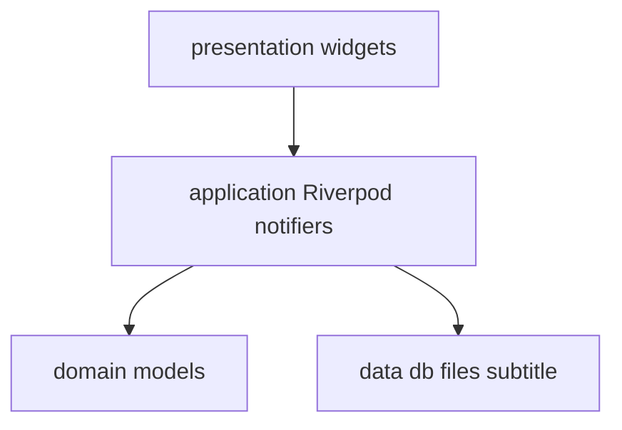
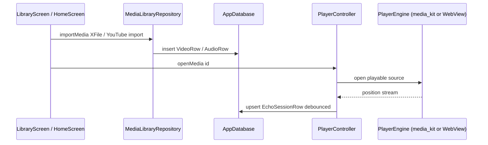

# Architecture

## Goals

- **Feature-first** folders under `lib/features/*` with shared `lib/core` and `lib/data`.
- **One `media_kit` `Player`** owned by [`MediaKitPlayerEngine`](../lib/features/player/application/player_engine.dart) for local/URL decode paths; **YouTube** uses a separate WebView engine (ADR-0003, ADR-0015).
- **Drift** as single local SQLite source of truth (ADR-0002).
- **Riverpod 3** for app state; codegen via `riverpod_annotation` where practical (ADR-0001).
- **Constitution gates** require code quality, testing, UX consistency, and performance evidence for user-visible changes.

## Layer map

## Runtime flow (MVP)

## Drift tables (summary)

| Table | Purpose |
|-------|---------|
| `videos` | Local / linked media: `localUri`, `md5` content fingerprint, `size`, `localMtimeMs` (cheap open trust check), `vid` hash, duration (seconds), sync metadata ([ADR-0050](decisions/0050-path-linked-local-media.md)) |
| `audios` | Same path-linked columns as `videos`, plus optional TTS fields and sync metadata |
| `transcripts` | `targetType` + `targetId` (weapp-style), JSON `timeline`, sync metadata |
| `echo_sessions` | Playback + echo window + primary/secondary transcript ids per target |
| `recordings` | Pronunciation recordings (sync-ready); time fields `duration`, `referenceStart`, `referenceDuration` in ms, aligned with API |
| `dictations` | Dictation attempts (sync-ready) |
| `sync_queue` | Offline-first outbound sync queue (`SyncCtrl` + [`features/sync.md`](features/sync.md)) |
| `settings` | Key/value JSON blobs (player prefs, hotkeys, **main API base URL**, **AI/Worker API base URL**, **auth profile cache**, app locale prefs) |
| `youtube_channel_subscriptions` | Discover subscriptions (`channelId`, `sourceType`, `feedUrl`, optional catalog `language`, fetch timestamps) |
| `youtube_feed_entries` | Append-only Discover feed cache keyed by video id ([ADR-0046](decisions/0046-discover-feed-append-only.md)) |
| `transcript_fetch_states` | Per-target transcript fetch bookkeeping; composite index `idx_transcript_fetch_states_target` on `(target_type, target_id)` |
| `ai_cache` | L2 AI result cache (`kind` + `key` PK, `payload_json`, `updated_at`) ([ADR-0045](decisions/0045-ai-result-cache-hierarchy.md)) |
| `vocabulary_items` | SRS review items per word+language pair: `easeFactor`, `interval`, `nextReviewAt`, `reviewsCount`, `status`, optional `explanation` ([ADR-0052](decisions/0052-vocabulary-local-first-schema.md), [features/vocabulary.md](features/vocabulary.md)) |
| `vocabulary_contexts` | Word appearances in media/ebook: `contextText`, `sourceType`, `sourceId`, `locatorJson`, FK to `vocabulary_items` via `vocabularyItemId` |
| `vocabulary_reviews` | Local undo audit trail per review: `rating`, `easeFactorBefore`, `intervalBefore`, `nextReviewAtBefore`, FK to `vocabulary_items` via `vocabularyItemId` — never synced |

`localUri` / `md5` / `size` predate schema v14 and store the playable reference plus SHA-256 fingerprint used for re-import / re-link matching. **v13 → v14** adds `localMtimeMs` for the cheap open trust check ([ADR-0050](decisions/0050-path-linked-local-media.md)).

### Schema upgrades (release note)

[`AppDatabase`](../lib/data/db/app_database.dart) is at **`schemaVersion: 15`**. Upgrades from versions **below 6** are **destructive** (JSON backup, drop legacy tables, `createAll`). From **v6 upward**, migrations are **incremental** — no library wipe:

| Step | Change |
|------|--------|
| v6 → v7 | Create `youtube_channel_subscriptions` + `youtube_feed_entries` |
| v7 → v8 | Add `youtube_feed_entries.duration_seconds` |
| v8 → v9 | `CREATE INDEX IF NOT EXISTS idx_transcript_fetch_states_target` |
| v9 → v10 | Add `youtube_channel_subscriptions.language` (catalog tag; not used as media content language after YT source-language removal) |
| v10 → v11 | Add `echo_sessions.blur_active` |
| v11 → v12 | Create `ai_cache` + `idx_ai_cache_kind_updated_at` ([ADR-0045](decisions/0045-ai-result-cache-hierarchy.md)) |
| v12 → v13 | Add `source_type` / `feed_url`; backfill `feed_url` using SQL column `channel_id` ([ADR-0051](decisions/0051-youtube-worker-discovery.md)) |
| v13 → v14 | Add `videos.local_mtime_ms` + `audios.local_mtime_ms` ([ADR-0050](decisions/0050-path-linked-local-media.md)) |
| v14 → v15 | Create `vocabulary_items` + `vocabulary_contexts` + `vocabulary_reviews` with 6 indexes; `vocabulary_reviews` (local audit) is never synced ([ADR-0052](decisions/0052-vocabulary-local-first-schema.md)) |

### Sync metadata mixins

The sync / audit columns (`syncStatus`, `serverUpdatedAt`, `createdAt`, `updatedAt`) that appear on most Drift tables are defined once in [`SyncMetadataColumns`](../lib/data/db/tables/sync_metadata.dart) and applied via `with SyncMetadataColumns on Table`. Tables that are never cloud-synced (e.g. `vocabulary_reviews`) use the narrower [`LocalAuditColumns`](../lib/data/db/tables/sync_metadata.dart) mixin instead (same columns minus `serverUpdatedAt`). This avoids repeating the four-column declaration across the nine tables that share it — see [`sync_metadata.dart`](../lib/data/db/tables/sync_metadata.dart).

### Per-user database cache

`app_database_provider.dart` keeps the most recent **two** per-user [`AppDatabase`](../lib/data/db/app_database.dart) instances in a bounded `LinkedHashMap`. On sign-in for a third account, the **oldest** entry is closed (and its Drift connections released) before the new one is inserted — see [ADR-0012](decisions/0012-per-user-sqlite-isolation.md) for the per-user isolation rationale. The cap keeps the file-handle / mmap footprint stable across guest ↔ account churn.

## Optional Enjoy account (auth)

- **HTTP:** `package:http` + small `ApiClient` under `lib/data/api/` (camelCase ↔ snake_case like `@enjoy/api`).
- **Service layer:** every `*Api` under `lib/data/api/services/` extends the [`RestApi`](../lib/data/api/rest_api.dart) base (one `client` field, shared via `@protected`) and returns the shared `JsonMap` typedef re-exported from [`api_client.dart`](../lib/data/api/api_client.dart). See [api/rest-services.md](api/rest-services.md) for the canonical pattern and how to pick between the three `*ApiClient` providers.
- **Tokens:** `flutter_secure_storage` (access token only).
- **Browser sign-in:** `url_launcher` for `start_auth` / `poll` flow ([ADR-0006](decisions/0006-auth-and-profile-sync.md), [features/auth.md](features/auth.md)).
- **Cloud metadata sync:** when signed in, [`SyncCtrl`](../lib/features/sync/application/sync_controller.dart) runs re-key for offline imports, drains `sync_queue`, and (when signed in and the player opens media) pulls recording metadata per target — see [ADR-0013](decisions/0013-local-first-sync.md), [features/sync.md](features/sync.md), [features/cloud.md](features/cloud.md).

## Routing

[`GoRouter`](../lib/core/routing/app_router.dart) + [`ShellRoute`](../lib/features/player/presentation/root_shell.dart): routes render beside an extended sidebar at wide breakpoints; [`GlobalTransportBar`](../lib/features/player/presentation/widgets/global_transport_bar.dart) spans the bottom when a playback session exists. An **`errorBuilder`** at the router root renders [`NotFoundScreen`](../lib/core/routing/not_found_screen.dart) (localized en / zh / zh-CN) for unknown locations; the screen surfaces the attempted URI and offers a single primary action to return to `/`.

### Player surface host (ADR-0057)

[`RootShell`](../lib/features/player/presentation/root_shell.dart) mounts one permanent [`PlayerSurfaceHost`](../lib/features/player/presentation/widgets/player_surface_host.dart) — the sole owner of `buildVideoStage()` for the active engine, keyed by engine identity so an engine swap disposes the old surface before mounting the new one. Viewports (vocabulary review clip, expanded player, loading stage) register [`PlayerSurfaceTarget`](../lib/features/player/presentation/widgets/player_surface_target.dart) geometry via [`playerSurfaceRegistryProvider`](../lib/features/player/application/player_surface_registry.dart); the host moves one permanent `Positioned` stage to the global target bounds and parks it off-corner when no target is attached, or when `RootShell` force-parks for `/youtube/login` so the player WebView cannot cover that route's WebView (no follower transforms, which keeps WebView2 bounds correct under Windows display scaling). Open-in-player is a single `context.replace` with a typed [`PlayerLaunchRequest`](../lib/features/player/domain/player_launch_request.dart). Feature code must not build `media_kit` `Video` / `InAppWebView` surfaces outside the host — see [ADR-0057](decisions/0057-permanent-player-surface-host.md).

## Form factor & orientation (ADR-0059)

Android/iOS devices are classified by the **display** logical shortest side — **≥ 600 → tablet, else phone** ([`kTabletShortestSideLogical`](../lib/core/platform/device_form_factor.dart)). Classification uses `FlutterView.display` (not window `physicalSize`) so a zero-sized bootstrap window or letterboxed compatibility mode cannot mis-lock a tablet to portrait. When metrics are not ready yet, bootstrap defers the lock instead of guessing phone. Phones prefer portrait only (`SystemChrome` on Android, `Info.plist` on iPhone); tablets allow all orientations; desktop never calls `setPreferredOrientations`.

Player **content** layout (stacked vs side-by-side video + transcript) is driven by the player layout constraints' aspect — `width > height` → side-by-side — via [`player_content_layout.dart`](../lib/core/platform/player_content_layout.dart), not by the 720-width breakpoint. The 720 breakpoint (`breakpointTranscriptSideBySide`) is retained for width-driven chrome such as transport-bar packing. Net effect: portrait tablets stack video over transcript even when wider than 720, and narrow landscape windows can lay out side-by-side below 720 — see [ADR-0059](decisions/0059-phone-tablet-orientation-and-player-aspect-layout.md).

## Manual providers

[`libraryMediaProvider`](../lib/features/library/application/library_media_provider.dart) is a hand-written `StreamProvider` because `riverpod_generator` + Drift row types hit an `InvalidTypeException` in codegen — keep this pattern documented if more stream providers need the same workaround.

## Main-isolate performance (Windows)

- **Do not** run `palette_generator` / heavy image analysis per item in large `GridView` / `ListView` builders on the UI isolate — see [features/library.md](features/library.md) § *Performance (signed-in cold start, Windows)*. Use Flutter DevTools **CPU profiler** on the UI thread when investigating jank or “Not responding” during scroll or startup.
- Plans that affect playback, startup, scrolling, transcript rendering, sync, or media import must state the expected performance budget or verification path before implementation.

## Sliver child identity (long live lists)

Sliver grids/lists backed by a Drift stream or RSS refresh (home recents, discover merged feed, channel feed) use a stable `ValueKey<String>` per row plus `findChildIndexCallback` — via the shared [`findSliverIndexByPrefixedId`](../lib/core/utils/sliver_key_index.dart) helper — so a re-emit that only inserts/reorders items reuses existing `Element`s instead of rebuilding every visible child. See [conventions.md § Sliver performance](conventions.md#sliver-performance-long-live-lists) for the required pattern when adding a new long-lived sliver.
