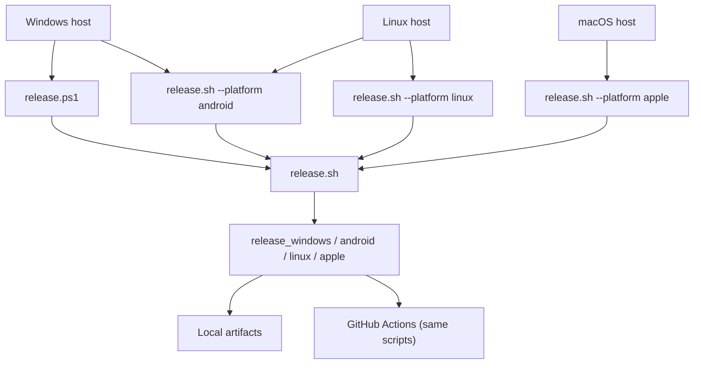

# Release & packaging

**Verify releases locally first.** GitHub Actions workflows call the same scripts you run on your machine.

## How users get the app

The public download page is at **[https://get.enjoy.bot](https://get.enjoy.bot)**. It detects the visitor's OS and surfaces the correct install action:

| Platform | Install path |
|----------|-------------|
| Windows | Direct download — `.exe` installer from `dl.enjoy.bot` |
| macOS | Direct download — notarized `.zip` from `dl.enjoy.bot` |
| Linux | Direct download — AppImage from `dl.enjoy.bot` (Ubuntu 22.04+, Fedora 39+, Debian 12) |
| Android | APK sideload from `dl.enjoy.bot` **or** Play Store beta enrollment |
| iOS | TestFlight beta invitation |

The page reads the current version from the release manifest (`dl.enjoy.bot/player/latest.json`) via a same-origin proxy, so download links update automatically after each release. Store/TestFlight links are configured in [`landing/config.js`](../landing/config.js).

See [ADR-0024](decisions/0024-download-landing-page.md) for hosting decisions and [Cloudflare Pages deploy](#landing-page-deploy) below for the deploy pipeline.

---

## Quick start

1. Bump `version:` in [`pubspec.yaml`](../pubspec.yaml) and update [`CHANGELOG.md`](../CHANGELOG.md).
2. Sync and verify platform metadata: `bash .github/scripts/sync_release_version.sh`. The script updates the checked-in Windows installer version; every other target derives its version from `pubspec.yaml` during build or packaging.
3. Run the release script for your platform (see [Host matrix](#host-matrix) below).
4. Confirm artifacts in the [output paths](#artifacts).
5. When ready, wire up CI — see [GitHub Actions](#github-actions-later).

### Version propagation

`pubspec.yaml` is the source of truth for both the marketing version and build
number (`version: X.Y.Z+N`). Do not hand-edit generated Flutter or Xcode files.

| Platform | Marketing version | Build number |
|----------|-------------------|--------------|
| Android | `versionName` from Flutter at build time | `versionCode` from Flutter at build time |
| iOS | `CFBundleShortVersionString` via `FLUTTER_BUILD_NAME` | `CFBundleVersion` via `FLUTTER_BUILD_NUMBER` |
| macOS | `MARKETING_VERSION` via `FLUTTER_BUILD_NAME` | `CURRENT_PROJECT_VERSION` via `FLUTTER_BUILD_NUMBER` |
| Windows executable | Flutter-generated `FLUTTER_VERSION` macros | Flutter-generated version macros |
| Windows installer | `MyAppVersion`, synced by `sync_release_version.sh` | Not stored separately |
| Linux | Flutter build metadata and AppImage filename from the pubspec version | Flutter build metadata |

---

## Release model



| Script | Role |
|--------|------|
| [`release.ps1`](../release.ps1) | Windows entry point (delegates to `release.sh` via Git Bash) |
| [`.github/scripts/release.sh`](../.github/scripts/release.sh) | Platform dispatcher |
| [`.github/scripts/release_windows.sh`](../.github/scripts/release_windows.sh) | Windows build + installer |
| [`.github/scripts/release_android.sh`](../.github/scripts/release_android.sh) | Play AAB + sideload APKs |
| [`.github/scripts/release_apple.sh`](../.github/scripts/release_apple.sh) | iOS IPA + macOS zip (macOS host only) |
| [`linux/packaging/make_appimage.sh`](../linux/packaging/make_appimage.sh) | Bundles the Linux build output into a self-contained AppImage |

---

## Store uploads & review (fastlane)

Store-facing uploads and App Store review actions run through [fastlane](https://docs.fastlane.tools) ([ADR-0094](decisions/0094-fastlane-store-uploads.md)) — pinned by the root [`Gemfile`](../Gemfile) / `Gemfile.lock`, Ruby 3.4 pinned in `mise.toml`. Builds stay with the platform scripts; fastlane only uploads and talks to the store APIs.

| Lane | What it does | Entry point |
|------|--------------|-------------|
| `android beta` | `upload_to_play_store` — AAB → Play **alpha** track, **draft** | `release.sh --platform android --play` |
| `ios beta` | `pilot` — IPA → TestFlight | `release.sh --platform apple --testflight` |
| `ios review_status` | Print the in-flight App Store version's review state | `bash .github/scripts/fastlane.sh ios review_status` |
| `ios submit_review` | Attach the latest processed build, answer the questionnaire, submit for review | `APP_VERSION="$(bash .github/scripts/read_pubspec_version.sh)" bash .github/scripts/fastlane.sh ios submit_review` |

All lanes read the same credentials as the release scripts (`APP_STORE_CONNECT_*`, `GOOGLE_PLAY_SERVICE_ACCOUNT_JSON*`); local runs pick up `~/.config/enjoy-player/{asc.env,AuthKey_<KEY_ID>.p8}` automatically. Reviewer replies and rejection notes stay manual — Apple's API exposes the review *state*, not the Resolution Center messages.

---

## Host matrix

| Host | Platforms | Command |
|------|-----------|---------|
| **Windows** | Windows installer | `pwsh ./release.ps1` |
| **Windows** | Android (AAB + APKs) | `pwsh ./release.ps1 -Platform android` |
| **Linux** | Android (AAB + APKs) | `bash .github/scripts/release.sh --platform android` |
| **Linux** | Linux (AppImage) | `bash .github/scripts/release.sh --platform linux` |
| **macOS** | iOS + macOS | `bash .github/scripts/release.sh --platform apple --notarize` |
| **macOS** | macOS zip only | `bash .github/scripts/release.sh --platform apple --macos-only --notarize` |

### Common flags

| Flag (PowerShell) | Flag (bash) | Effect |
|-------------------|-------------|--------|
| `-SkipChecks` | `--skip-checks` | Skip `flutter analyze` / `flutter test` |
| `-PublishOnly -Publish` | `--publish-only --publish` | Re-upload existing artifacts (no build, no checks) |
| `-Publish` | `--publish` | Build + upload to `dl.enjoy.bot` |
| `-FeedsOnly` | `--feeds-only` | Build local update feeds only (no S3) |

Android-only flags: `--play` / `-Play` (upload store AAB to Google Play **alpha** track as a **draft**), `--no-apk`, `--no-aab`.

Apple-only flags: `--notarize` (macOS direct download; auto-enabled when `--publish` builds a macOS zip), `--testflight` (upload IPA), `--macos-only` (skip iOS build).

---

## One-time setup

### All platforms

```bash
flutter pub get
```

Pre-release checks (also run automatically unless `--skip-checks`):

```bash
dart format --output=none --set-exit-if-changed .
flutter analyze
flutter test
```

### Windows

- **Git for Windows** (Git Bash) — required by `release.ps1`
- **PowerShell 7+** (`pwsh`)
- **NuGet CLI** on `PATH` — WebView2 native restore ([README](../README.md))
- **Inno Setup 6** — installer build (script can install via Chocolatey on CI)

### Linux (Android)

- **Flutter** + **Android SDK** (Java 17)
- After `flutter pub get`, run [`tool/patch_agp9_pub_plugins.sh`](../tool/patch_agp9_pub_plugins.sh) (done automatically by release script)

### Linux (AppImage)

- **Flutter** + Linux desktop toolchain:
  ```bash
  sudo apt-get install -y \
    clang cmake curl git jq ninja-build pkg-config unzip xz-utils zip \
    libgtk-3-dev liblzma-dev libsqlite3-dev \
    libgstreamer1.0-dev libgstreamer-plugins-base1.0-dev \
    libsecret-1-dev libmpv-dev ffmpeg
  ```
- **`appimagetool`** on `PATH`. Download the latest AppImage from [appimagetool releases](https://github.com/AppImage/AppImageKit/releases), make executable, and place in `PATH`:
  ```bash
  wget https://github.com/AppImage/AppImageKit/releases/download/continuous/appimagetool-x86_64.AppImage
  chmod +x appimagetool-x86_64.AppImage
  sudo mv appimagetool-x86_64.AppImage /usr/local/bin/appimagetool
  ```
- No signing key required; AppImage auto-update is intentionally out of scope for v1 (see [ADR-0048](decisions/0048-linux-platform-support.md)).

### macOS (Apple)

- **Xcode** + **CocoaPods** + Apple Developer team **`46X685R747`**
- **Homebrew** + FFmpeg deps: `brew bundle install --file=macos/Brewfile`
- The Xcode target bundles FFmpeg/media-kit's Homebrew dylib dependencies into
  `Contents/Frameworks/`. This includes relocatable references such as
  `/opt/homebrew/*/libssl.3.dylib`; the bundler resolves them through installed
  formula prefixes and rewrites them to `@rpath`, which is required for
  notarized apps because external Homebrew libraries have a different signing
  team.
- **App Store Connect app** for bundle ID `ai.enjoy.player` (required for full `--platform apple` runs that build iOS)
- **Keychain certs** (OS Keychain, not files in the repo): Apple Distribution (iOS / TestFlight) and Developer ID Application (macOS direct download)
- **Local Apple secrets** (one directory — shared by local release and the self-hosted Mac runner):

  ```
  ~/.config/enjoy-player/
    asc.env                 # APP_STORE_CONNECT_API_KEY_ID + ISSUER_ID
    AuthKey_<KEY_ID>.p8     # App Store Connect API private key (mode 600)
  ```

  Do **not** put ASC keys in `publish_env.local.sh` (that file is for R2/Play). Repo `.apple/` is a legacy fallback only — prefer the config dir above. CI also injects the same values as GitHub Actions secrets; helpers cache them into this directory.

  Preflight: `bash .github/scripts/verify_macos_release_env.sh`

- **Notary credentials** (for `--notarize`), either:
  - **Local (Apple ID)**: store an app-specific password in Keychain as `AC_PASSWORD`, then:
    ```bash
    xcrun notarytool store-credentials "enjoy-notary" \
      --apple-id "you@example.com" \
      --team-id "46X685R747" \
      --password "@keychain:AC_PASSWORD"
    ```
  - **API key** (CI / local): the three `APP_STORE_CONNECT_*` values (env or `~/.config/enjoy-player/`) — the release script registers profile `enjoy-notary` automatically when `--notarize` is set
- **TestFlight upload** (for `--testflight`): same ASC credentials; the IPA goes up via fastlane `pilot` ([ADR-0094](decisions/0094-fastlane-store-uploads.md)). `--testflight` fails hard if credentials are still missing (no silent skip). Build outputs (IPA / zip) stay under `build/` and are ephemeral — not part of credential setup.
- **Sparkle auto-update** (before `--publish`): run once on Mac — `dart run auto_updater:generate_keys`, **paste the printed `SUPublicEDKey` into [`macos/Runner/Info.plist`](../macos/Runner/Info.plist)** (private key stays in Keychain), then `bash .github/scripts/verify_sparkle_setup.sh`

### Android signing

1. Create an upload keystore (keep out of git).
2. Copy [`android/key.properties.example`](../android/key.properties.example) → **`android/key.properties`** (gitignored).
3. Fill `storePassword`, `keyPassword`, `keyAlias`, `storeFile` (`storeFile` is relative to `android/`).

**Without `key.properties`, release builds use the debug keystore — do not upload those to Play.**

### Google Play upload (for `--play`)

One-time API access (see [android-release-ci.md](android-release-ci.md#upload-to-google-play)):

1. Enable **Google Play Android Developer API** on a GCP project and create a service account + JSON key.
2. Play Console → **Users and permissions** → invite the service account email with permission to manage closed testing (alpha) releases for `ai.enjoy.player`.
3. Locally set `GOOGLE_PLAY_SERVICE_ACCOUNT_JSON_PATH` to that JSON file (or put the path in `publish_env.local.*`). CI uses secret `GOOGLE_PLAY_SERVICE_ACCOUNT_JSON_BASE64` (`base64 -w0` of the JSON).

Defaults: package `ai.enjoy.player`, track `alpha`, status `draft`. Override with `GOOGLE_PLAY_TRACK` / `GOOGLE_PLAY_RELEASE_STATUS` if needed. The upload runs via fastlane `supply` ([ADR-0094](decisions/0094-fastlane-store-uploads.md)) and needs **Ruby ≥ 3.2** (pinned in [`mise.toml`](../mise.toml); `ensure_fastlane_tooling.sh` installs the `Gemfile.lock`-pinned gems into a repo-local path).

### Apple signing

- **Bundle ID**: `ai.enjoy.player` (ADR-0020)
- iOS: automatic signing in Xcode; export via [`ios/ExportOptions.export.plist`](../ios/ExportOptions.export.plist)
- macOS direct download: compile unsigned, then **Developer ID Application** sign + notarization in post-steps (`build_macos_release.sh` + `notarize_release.sh` using `ReleaseDirect.entitlements`; Debug/Profile keep Apple Development + `DebugProfile.entitlements` for local runs). Use the app's own `keychain-access-groups` entry (`$(AppIdentifierPrefix)$(CFBundleIdentifier)`) for secure storage — never an empty array (launch error 163) and never Sign in with Apple (unsupported on Developer ID).

### Publish credentials (optional)

Only needed when uploading to `dl.enjoy.bot`. Install **AWS CLI v2**:

- **macOS**: `brew install awscli`
- **Windows**: `winget install Amazon.AWSCLI`

Credentials are loaded into the shell environment from a **local, gitignored** file
(`publish_env.local.ps1` on Windows, `publish_env.local.sh` elsewhere) or, in CI,
from GitHub Actions secrets. **Never commit real AWS/R2 access keys or secret keys** —
the pre-commit hook ([`.githooks/pre-commit`](../.githooks/pre-commit)) blocks
credential-shaped strings (`AKIA…`, 64-hex R2 secrets) and the local credential
files themselves. If you have ever pasted real keys into a working-tree file,
**rotate them in Cloudflare R2** and start from a clean local copy.

#### Recommended secret sources

Prefer one of these over a plaintext working-tree file so credentials never touch
the repository disk:

| Source | When to use | How to load |
|--------|-------------|-------------|
| **GitHub Actions secrets** | CI releases | Reference as `${{ secrets.R2_ACCESS_KEY_ID }}` in the workflow; the workflow sets the same `AWS_*` / `PUBLISH_*` env vars |
| **Windows Credential Manager** | Local Windows releases | Read into the session before running `release.ps1`, e.g. via `cmdkey` or a vault CLI, exporting the same env vars |
| **1Password CLI** (`op`) | Any local host | `export AWS_SECRET_ACCESS_KEY="$(op read 'op://Private/r2/secret')"` etc. before `release.sh` |

The local `publish_env.local.*` loaders are a convenience for maintainers who
prefer a dotenv-style flow; keep them on disk only, never in git.

#### WinSparkle DSA private key

`sign_sparkle_enclosure.sh` resolves the DSA private key for Windows appcast
signing in this order:

1. `SPARKLE_DSA_PRIV_PEM` env var (an absolute path to the key file)
2. `SPARKLE_DSA_PRIV_PEM_BASE64` env var (base64-encoded key, decoded to a temp file)
3. `dsa_priv.pem` at the **repo root** (auto-detected — the recommended default)

Because the repo-root path is auto-detected, **do not hardcode an absolute path**
in your local env file. If the key lives elsewhere, resolve it relative to the
repo root:

```bash
# bash / macOS / Linux
export SPARKLE_DSA_PRIV_PEM="$(git rev-parse --show-toplevel)/keys/dsa_priv.pem"
```

```powershell
# PowerShell
$env:SPARKLE_DSA_PRIV_PEM = Join-Path (git rev-parse --show-toplevel) "keys/dsa_priv.pem"
```

CI injects the key as base64 via `SPARKLE_DSA_PRIV_PEM_BASE64` (see
[`sign_sparkle_enclosure.sh`](../.github/scripts/sign_sparkle_enclosure.sh)).

#### Local publish setup

```powershell
# Windows
Copy-Item .github\scripts\publish_env.example.ps1 .github\scripts\publish_env.local.ps1
# edit AWS_* / PUBLISH_* values, then:
pwsh ./release.ps1 -Publish

# Verify credentials (optional)
. .\.github\scripts\publish_env.local.ps1
aws s3 ls "s3://$env:PUBLISH_BUCKET/" --endpoint-url $env:AWS_ENDPOINT_URL_S3
```

```bash
# macOS / Linux / Git Bash
cp .github/scripts/publish_env.example.sh .github/scripts/publish_env.local.sh
# edit values, then:
bash .github/scripts/release.sh --platform apple --publish
```

#### Git hooks (secrets + CI gates)

After cloning, point Git at the repo hooks so credential-shaped strings cannot
be committed and format / codegen drift cannot be pushed:

```bash
git config core.hooksPath .githooks
```

| Hook | What it blocks |
|------|----------------|
| [`.githooks/pre-commit`](../.githooks/pre-commit) | AWS/R2 credential patterns and forbidden local credential / key files |
| [`.githooks/pre-push`](../.githooks/pre-push) | Unformatted Dart and stale `build_runner` outputs (same checks as CI) |

Bypass with `git commit --no-verify` / `git push --no-verify` only for a known-good
false positive, and note it in the commit message. Prefer fixing with
`bash .github/scripts/validate_ci_gates.sh --fix` instead.

---

## Local release commands

### Windows installer

```powershell
pwsh ./release.ps1                      # checks + build + installer
pwsh ./release.ps1 -SkipChecks          # faster iteration
```

Builds: `flutter build windows --release`, fetches FFmpeg, runs Inno Setup.

### Android (Windows or Linux)

```powershell
# Windows
pwsh ./release.ps1 -Platform android
pwsh ./release.ps1 -Platform android -Play   # also upload AAB to Play (alpha / draft)
```

```bash
# Linux (or Git Bash)
bash .github/scripts/release.sh --platform android
bash .github/scripts/release.sh --platform android --play
# Re-upload an already-built AAB:
bash .github/scripts/release.sh --platform android --publish-only --play
```

Builds:

- **Play AAB**: `flutter build appbundle --release --flavor store`
- **Sideload APKs**: `flutter build apk --release --split-per-abi --flavor direct --dart-define=DISTRIBUTION_CHANNEL=direct`
- **`--play`**: upload the store AAB to Google Play closed testing (**alpha**) as a **draft** (skipped if Play service-account env is unset)

### Linux AppImage

```bash
bash .github/scripts/release.sh --platform linux           # build + AppImage packaging
bash .github/scripts/release.sh --platform linux --publish # build + upload to dl.enjoy.bot
```

Builds: `flutter build linux --release`, then wraps the bundle with `linux/packaging/make_appimage.sh`. The resulting AppImage (`enjoy-player-<version>-x86_64.AppImage`) is self-contained — includes the Flutter runtime, `media_kit`'s bundled `libmpv`, and `media_kit_libs_video`'s bundled `ffmpeg`. No `sudo` or package-manager install needed on the target machine.

### iOS + macOS (macOS host only)

**macOS direct download** (fastest first local test — skips iOS):

```bash
bash .github/scripts/verify_macos_release_env.sh          # certs, keychain, Homebrew
bash .github/scripts/release.sh --platform apple --macos-only --notarize
bash .github/scripts/release.sh --platform apple --macos-only --notarize --skip-checks  # iteration
```

**Full Apple release** (iOS IPA + TestFlight + notarized macOS zip):

```bash
bash .github/scripts/release.sh --platform apple --notarize --testflight
```

**iOS / TestFlight only** (skip macOS):

```bash
bash .github/scripts/release.sh --platform apple --ios-only --testflight --skip-checks
```

The default `release_apple.sh` path builds **both** iOS and macOS unless `--macos-only` or `--ios-only` is passed. macOS builds use `--dart-define=DISTRIBUTION_CHANNEL=direct` (Sparkle auto-update). Expect **15–30+ minutes** when notarization is enabled.

---

## Artifacts

Version comes from `pubspec.yaml` (`version: 0.8.1+10` → `0.8.1` in filenames).

| Platform | Output (example at `0.8.1`) |
|----------|-----------------------------|
| Windows installer | `build/windows/installer/EnjoyPlayerSetup-v0.8.1.exe` |
| Android (Play) | `build/app/outputs/bundle/release/EnjoyPlayer-v0.8.1.aab` |
| Android (sideload) | `build/app/outputs/flutter-apk/EnjoyPlayer-v0.8.1-arm64-v8a.apk` (+ `armeabi-v7a`, `x86_64`) |
| iOS | `build/ios/ipa/EnjoyPlayer-v0.8.1.ipa` |
| macOS | `EnjoyPlayer-macOS-v0.8.1.zip` (repo root) |
| Linux AppImage | `enjoy-player-v0.8.1-x86_64.AppImage` (repo root) |

After a successful run, scripts print artifact paths. For manual rename only:

```bash
bash .github/scripts/rename_release_artifacts.sh android   # after flutter build
bash .github/scripts/rename_release_artifacts.sh apple
```

---

## Distribution channels

| Artifact | Channel | Auto-update |
|----------|---------|-------------|
| Play AAB (`store` flavor) | Google Play | No |
| Sideload APK (`direct` flavor) | Direct download | Yes (`ota_update`) |
| Windows installer | Direct download | Yes (WinSparkle) |
| macOS zip | Direct download | Yes (Sparkle) |
| Linux AppImage | Direct download | No (manual update; AppImageUpdate planned per ADR-0048) |
| iOS IPA | TestFlight / App Store | No |

Direct builds check `https://dl.enjoy.bot/player/latest.json` (ADR-0023). Store builds do not.

---

## Publish to dl.enjoy.bot (optional)

Skip this until local builds work. When ready:

```powershell
pwsh ./release.ps1 -Publish             # Windows: build + upload
pwsh ./release.ps1 -PublishOnly -Publish # upload every built artifact (Windows/Android/macOS)
```

Per-platform build + publish:

```powershell
pwsh ./release.ps1 -Platform android -Publish
bash .github/scripts/release.sh --platform apple --publish-only --publish
bash .github/scripts/release.sh --platform all --publish-only --publish
```

When you publish **one platform at a time** for the same semver, the script **merges** into the existing `latest.json` / `appcast.xml` (downloads the public feed from `dl.enjoy.bot`, then overlays the new platform’s assets). Re-publish all platforms after a bad overwrite:

```bash
bash .github/scripts/release.sh --platform all --publish-only --publish
```

Requires **`jq`** on the publish host (`brew install jq` on macOS).

**Test auto-update locally (no S3):**

```powershell
pwsh ./release.ps1 -FeedsOnly
cd build/release/serve && python -m http.server 8787
# feeds at http://127.0.0.1:8787/player
```

Sparkle / WinSparkle keys: see [ADR-0023](decisions/0023-app-update-distribution.md). Verify wiring:

```bash
bash .github/scripts/verify_sparkle_setup.sh
```

---

## GitHub Actions (later)

After local verification, enable CI. Each workflow calls the same platform script.

| Workflow | Runner | Local equivalent |
|----------|--------|------------------|
| [`release_windows.yml`](../.github/workflows/release_windows.yml) | `windows-latest` | `pwsh ./release.ps1` |
| [`release_android.yml`](../.github/workflows/release_android.yml) | self-hosted Linux | `bash .github/scripts/release.sh --platform android --play` |
| [`release_apple.yml`](../.github/workflows/release_apple.yml) | self-hosted macOS | `bash .github/scripts/release.sh --platform apple --notarize --testflight` |
| [`release_linux.yml`](../.github/workflows/release_linux.yml) | self-hosted Linux | `bash .github/scripts/release.sh --platform linux` |
| [`release_publish.yml`](../.github/workflows/release_publish.yml) | `ubuntu-latest` | finalize notes / draft→ready on a tag |

The [`build_linux.yml`](../.github/workflows/build_linux.yml) workflow covers compile smoke on CI; the release AppImage is produced by the dedicated `release_linux.yml` workflow above (or locally via `release.sh --platform linux [--publish]`).

Triggers: both **`workflow_dispatch`** (manual per-platform rerun) and **`push: tags: ['v*.*.*']`** (auto for tag pushes). The four per-platform workflows stay independent because each requires a different self-hosted runner and a different secret surface (Apple keychain + notary creds, Android Play SA + keystore, Windows Sparkle DSA). See [ADR-0067](decisions/0067-github-release-publishing.md) for the design.

### GitHub Release flow

When a tag like `v0.7.3` is pushed, the four `release_*.yml` workflows run in parallel and each uploads its artifacts to a **draft** GitHub Release for that tag using [`softprops/action-gh-release@v2`](https://github.com/softprops/action-gh-release). Re-running any one platform is safe — the action is idempotent and only adds/replaces the named assets.

After all four platforms finish, promote the draft with [`release_publish.yml`](../.github/workflows/release_publish.yml):

1. Actions → **Publish GitHub Release** → **Run workflow**.
2. Leave `tag_name` blank to auto-pick the latest draft, set `notes_file` (default: `docs/releases/<version>.md` or `CHANGELOG.md`), set **`finalize=true`** to unmark draft.

The same `--publish-github` flag works locally:

```bash
bash .github/scripts/release.sh --platform apple  --publish-only --publish-github
bash .github/scripts/release.sh --platform all    --publish-only --publish-github
```

This calls [`release_lib.sh::release_publish_github`](../.github/scripts/release_lib.sh) which uses `gh release` (authenticate once with `gh auth login`). It creates the release as a draft; promote via the workflow above or `gh release edit vX.Y.Z --draft=false`.

Platform CI setup (secrets, runners):

- [windows-release-ci.md](windows-release-ci.md)
- [android-release-ci.md](android-release-ci.md)
- [apple-release-ci.md](apple-release-ci.md)
- [ci-self-hosted-runners.md](ci-self-hosted-runners.md)

---

## Troubleshooting

### Android

- **Release APK crashes immediately with `Wrong full snapshot version`**: Flutter 3.44 Gradle regression when using product flavors (`store` / `direct`) — stale `libapp.so` can be packaged into the APK while `libflutter.so` expects a newer AOT snapshot ([flutter/flutter#187553](https://github.com/flutter/flutter/issues/187553)). Debug builds are unaffected. The project applies a Gradle workaround in [`android/app/build.gradle.kts`](../android/app/build.gradle.kts) and prunes JNI merge intermediates in [`release_android.sh`](../.github/scripts/release_android.sh). Rebuild the direct release APK (`flutter clean` if needed), uninstall the broken install, and reinstall. Remove the Gradle workaround after upgrading to a Flutter stable that includes [flutter/flutter#187688](https://github.com/flutter/flutter/pull/187688).
- **Debug-signed AAB/APK**: missing `android/key.properties` — create from example and rebuild.
- **Gradle / `dl.google.com` TLS**: mirrors are in [`settings.gradle.kts`](../android/settings.gradle.kts); use JDK 17; check VPN/proxy.
- **`media_kit_libs_android_video` / `Connection timed out` downloading `default-*.jar`**: the plugin fetches libmpv JARs from GitHub Releases during Gradle configuration with Java `URL.openStream()` (no retries). A timeout can leave a **0-byte** jar under `build/media_kit_libs_android_video/v1.1.7/`, which then fails MD5 and re-downloads on every evaluate. Run [`tool/prefetch_media_kit_android_libs.sh`](../tool/prefetch_media_kit_android_libs.sh) (curl + retries + MD5; also run by `release_android.sh` and Android smoke CI) before `flutter build`, or delete the empty jars and retry on a stable network. Optional mirror: `MEDIA_KIT_ANDROID_LIBS_BASE_URL`.
- **`packageStoreReleaseBundle` OutOfMemoryError**: the Play AAB is large (~180MB with ffmpeg-kit native libs). The previous `MaxMetaspaceSize=4G` in [`android/gradle.properties`](../android/gradle.properties) let Gradle reserve up to ~12G virtual memory, which often fails after `flutter test` on 16GB Windows hosts. Release scripts stop Gradle daemons before building. If it still fails, close other heavy apps, run `./android/gradlew --stop`, and retry with `pwsh ./release.ps1 -Platform android -SkipChecks`.
- **`lintVitalAnalyze*` / `OutOfMemoryError: Metaspace`**: Android Lint's UAST analysis of plugins (e.g. `PortCleaner.java`) can exhaust the 512m Metaspace cap. [`android/app/build.gradle.kts`](../android/app/build.gradle.kts) sets `lint.checkReleaseBuilds = false` so release AAB/APK packaging skips lintVital. Run `./android/gradlew :app:lint` when you want a dedicated lint pass.
- **AGP 9 plugin errors**: run `tool/patch_agp9_pub_plugins.ps1` (Windows) or `tool/patch_agp9_pub_plugins.sh` (Linux/macOS) after `flutter pub get`. Android release scripts run the bash patch automatically before building.
- **`cannot find symbol SharePlusPlugin`**: `share_plus` 13.2+ assumes AGP 9 enables built-in Kotlin and skips applying KGP. This repo keeps `android.builtInKotlin=false`, so the plugin's Kotlin never compiles. Re-run the AGP 9 patch scripts above (they force-apply KGP for `share_plus` and clear stale `build/share_plus` outputs), then rebuild. On Windows, prefer the `.ps1` patcher or a current `.sh` that resolves `%LOCALAPPDATA%/Pub/Cache`.
- **`file_picker` unresolved `FileUtils` references**: after upgrading `file_picker`, Gradle can retain an incomplete Kotlin source snapshot. The AGP 9 patch scripts clear `build/file_picker`; rerun either patch script above and rebuild.

### Windows

- **`release.ps1` needs Git Bash**: install [Git for Windows](https://git-scm.com/download/win); WSL bash is not supported.
- **NuGet / WebView2 restore fails**: ensure `nuget` on PATH with `nuget.org` source — see [README](../README.md).
- **Missing FFmpeg features**: run `pwsh windows/scripts/fetch_ffmpeg.ps1` before build.
- **WebView2**: required at runtime for YouTube / in-app WebView.

#### Windows FFmpeg provisioning

`ffmpeg_kit_flutter_new` (under `packages/`) ships Android / iOS / macOS
platform implementations but **no Windows or Linux implementation**. The
Windows build does not bundle ffmpeg via a Flutter plugin; instead the release
script downloads a GPL `ffmpeg.exe` into `windows/ffmpeg/` before
`flutter build windows --release`. Linux shares the CLI contract
([`FfmpegMediaProbe`](../lib/data/files/ffmpeg_media_probe.dart) looks for
`ffmpeg` next to the executable or under `lib/`, then on PATH); the AppImage
does not bundle a CLI `ffmpeg` today, so extraction degrades to a no-op on
machines without one.

| Step | Script | Source | Verified by |
|------|--------|--------|-------------|
| Download | [`windows/scripts/fetch_ffmpeg.ps1`](../windows/scripts/fetch_ffmpeg.ps1) | Gyan.dev `ffmpeg-release-essentials.zip` | SHA-256 from `*.sha256` sidecar |
| Bundle | `flutter build windows` includes `windows/ffmpeg/ffmpeg.exe` in the build output | n/a | Inno Setup packs the binary |
| License | `windows/ffmpeg/README.md` | n/a | Reviewed before each public release |

The downloader is idempotent (skips if `ffmpeg.exe -version` already
succeeds) and fails closed on SHA-256 mismatch. The script does **not**
run automatically as part of `flutter pub get`; trigger it explicitly
when setting up a fresh Windows machine or when you need to bump the
bundled FFmpeg. Do not commit `windows/ffmpeg/ffmpeg.exe` — it is
git-ignored.

### Apple

- **macOS DYLD / missing Homebrew dylib**: run `brew bundle install --file=macos/Brewfile` and rebuild; the release bundle must contain the dependency under `Contents/Frameworks/` with an `@rpath` load path.
- **Keychain / signing on new Mac**: open `macos/Runner.xcworkspace`, enable automatic signing, team `46X685R747`, build once in Xcode.
- **Notarization fails**: check `NOTARY_PROFILE` (default `enjoy-notary`) and stored credentials; unlock the login keychain if `notarytool` reports `keychainLocked` or `errSecInternalComponent`:
  ```bash
  security unlock-keychain login.keychain-db
  bash .github/scripts/release.sh --platform apple --macos-only --notarize --skip-build --skip-checks
  ```
- **`deadlineExceeded` / `abortedUpload` during notary upload**: signing succeeded; Apple's notary upload timed out (large ~200MB+ bundle, slow/VPN network). Retry upload only:
  ```bash
  ./macos/scripts/notarize_release.sh "build/macos/Build/Products/Release/Enjoy Player.app" --skip-sign
  ```
  The script retries automatically (5 attempts). Disable VPN/proxy if uploads keep failing.
- **No Developer ID identity**: install Developer ID Application cert or set `SIGN_IDENTITY` before running `notarize_release.sh`.
- **`HTTP status code: 403. A required agreement is missing or has expired.`**: not a build problem — the Apple Developer team (`46X685R747`) has an unsigned/expired legal agreement (e.g. annual Program License Agreement or Paid Apps Agreement renewal). Sign in to [App Store Connect](https://appstoreconnect.apple.com) or [developer.apple.com/account](https://developer.apple.com/account) with an Admin/Legal role, accept the pending agreement, then retry the upload only (app is already signed):
  ```bash
  ./macos/scripts/notarize_release.sh "build/macos/Build/Products/Release/Enjoy Player.app" --skip-sign
  ```
- **ITMS-90426 / 90429 Invalid Swift Support**: App Store Connect reports this when a standalone `.dylib` is in `Runner.app/Frameworks/` (TN2435). iOS embeds `eSpeakNG.xcframework`, not `libespeak-ng.dylib`. `check_ios_ipa.sh` fails the release if any naked `.dylib` is present. Do not inject a fake `SwiftSupport/` folder to paper over this.
- **TestFlight credentials missing** (local): put `asc.env` + `AuthKey_<KEY_ID>.p8` under `~/.config/enjoy-player/` (or export the three `APP_STORE_CONNECT_*` env vars), then re-run `bash .github/scripts/verify_macos_release_env.sh`. With `--testflight`, a missing key is a hard error — not a soft skip.
- **TestFlight upload only** (IPA already built):
  ```bash
  bash .github/scripts/release.sh --platform apple --ios-only --testflight --skip-build --skip-checks
  ```

### Publish (R2 / AWS CLI)

- **`SSL: UNEXPECTED_EOF_WHILE_READING`**: the publish script uses CRC32 checksums and single-connection multipart for R2. Try disabling VPN/proxy or updating AWS CLI.
- **`AccessDenied`**: R2 token needs **Object Read & Write** scoped to `PUBLISH_BUCKET`.

### General

- **Low disk space / `No space left on device` during `flutter test`**: macOS releases need several GB free for tests and `xcodebuild` temp files. For `--macos-only`, the release script prunes `build/ios` and `build/test_cache` only when free space drops below 4GB; if still low, run `flutter clean` or free space system-wide. `--skip-build` notarize retries only require ~512MB free.
- **Stale `build/release/pubspec.yaml`**: causes `flutter analyze` path errors — release scripts prune these automatically.
- **Hot restart on macOS**: unreliable with native stack; use hot reload or full restart.

---

## Platform reference

Identity: **`ai.enjoy.player`** everywhere ([ADR-0020](decisions/0020-android-windows-release-identity.md)).

| Platform | Min target | Notes |
|----------|------------|-------|
| Android | minSdk 26, Java 17 | AGP 9; vendored `ffmpeg_kit_flutter_new` |
| iOS | 15.0 | `use_frameworks!` for Azure Speech, FFmpeg |
| macOS | 10.15 | App Sandbox on; GPL FFmpeg bundled |
| Windows | x64 | Authenticode signing outside repo |
| Linux | x86_64 | AppImage; bundled `libmpv` + `ffmpeg`; Ubuntu 22.04+ / Fedora 39+ / Debian 12 |

### eSpeak-NG (alignment reference)

`packages/forced_alignment` may load a vendored **libespeak-ng** plus a trimmed
`espeak-ng-data` tree from `packages/forced_alignment/native/` (lazy
`DynamicLibrary.open`). This is an internal alignment input only — it is never
played to the learner and does not replace Craft/library audio.

- Missing lib or data at runtime → `spokenReferenceUnavailable` (not a test
  failure).
- Binaries are vendored from official eSpeak-NG 1.52.0 sources for
  `windows/`, `linux/` (x86_64), `macos/` (universal), `android/`
  (arm64-v8a, armeabi-v7a, x86_64; 16 KB page-aligned for Play), and
  `ios/` (iphoneos arm64 + iphonesimulator universal). Provenance and
  rebuild notes live in `packages/forced_alignment/native/README.md`.
  iOS rebuilds run `native/build_ios.sh` on a macOS host with Xcode.
- macOS and iOS app targets copy `espeak-ng-data` into the `.app` via
  `native/bundle_into_app.sh` (Xcode "Bundle eSpeak-NG" phase) so packaged
  `align` / `alignSegments` can `DynamicLibrary.open` without the source
  tree. **The native library is embedded by the Xcode "Embed Frameworks"
  `CopyFiles` build phase** (`dstSubfolderSpec = 10`, `Frameworks/`):
  macOS copies `libespeak-ng.dylib`; iOS copies `eSpeakNG.xcframework`
  (`CodeSignOnCopy` / `RemoveHeadersOnCopy`). A naked `.dylib` in an iOS
  `Frameworks/` folder is not supported (TN2435) and App Store Connect
  reports it as ITMS-90426 ("SwiftSupport folder is missing") or
  ITMS-90429. The bundle script verifies the embedded binary is present
  so a missing library fails the build instead of silently dropping the
  spoken-reference at runtime (`spokenReferenceUnavailable` → "failed to
  generate, tap to retry"). It does not mutate or re-sign nested code
  after Embed Frameworks. Release packaging also removes an empty iOS
  `Contents/Resources/` container that Xcode can leave behind and that
  `codesign` rejects as unsealed root content. The exported IPA is
  checked for `eSpeakNG.framework`, no standalone `.dylib` files under
  `Frameworks/`, `MinimumOSVersion` 15.0, and strict code-sign
  verification.
  Android ships the per-ABI `.so` through jniLibs and `espeak-ng-data`
  as Flutter assets extracted at startup
  (`lib/core/platform/espeak_android_provisioner.dart`). The provisioning
  itself runs **off the startup critical path** (`unawaited`, issue #810 B1)
  and the 31-file synchronous extraction runs under `Isolate.run` (issue
  #818), so first install and every `kEspeakDataRevision` bump can no longer
  jank the UI isolate. Flutter does **not** recurse directory assets —
  `pubspec.yaml` must list `espeak-ng-data/` **and**
  `espeak-ng-data/lang/` or `espeak_SetVoiceByName(en-us)` fails on device
  while Windows (source-tree files) still works. Windows/Linux desktop app
  bundles remain a follow-up.
- **CI gates**: unit tests assert iOS (`Runner.app/espeak-ng-data`) and macOS
  (`Contents/Resources/espeak-ng-data`) layouts include every mapped `lang/`
  voice and can phonemize `en-US`. [Build Apple](../.github/workflows/build_apple.yml)
  runs `.github/scripts/check_bundled_espeak_data.sh` on the compiled `.app`,
  passing both the data directory and the native library path so a
  missing embed fails the gate. iOS asserts
  `Frameworks/eSpeakNG.framework/eSpeakNG`; macOS asserts
  `Contents/Frameworks/libespeak-ng.dylib`.
  [Android APK smoke](../.github/workflows/android_apk_smoke.yml) greps the
  APK for `lang/en-us`, not only `phontab`.
- `packages/forced_alignment`'s eSpeak FFI tests run unconditionally on
  vendored host platforms — a load failure is a regression, not a skip.
- eSpeak-NG is GPL-3.0; linking into this AGPL-3.0 app is recorded in
  [ADR-0072](decisions/0072-spoken-alignment-reference.md).
- Do not compile eSpeak-NG from source on every `flutter test`.

Further reading: [architecture.md](architecture.md), [testing.md](testing.md), platform folders under `android/`, `ios/`, `macos/`, `windows/`.

---

## Landing page deploy

The landing page lives in [`landing/`](../landing/) — a standalone static site (not a Flutter web build). It is deployed independently of the app.

### Prerequisites

Set two repository secrets (Settings → Secrets → Actions):

| Secret | Value |
|--------|-------|
| `CLOUDFLARE_API_TOKEN` | A Cloudflare API token with **Cloudflare Pages: Edit** permission |
| `CLOUDFLARE_ACCOUNT_ID` | Your Cloudflare account ID |

### Automatic deploys

`.github/workflows/deploy_landing.yml` deploys automatically:
- **Production** — any push to `main` that touches `landing/**`
- **Preview** — any PR touching `landing/**` (PR comment links to the preview URL)
- **Manual** — workflow dispatch from the Actions tab

### Manual local deploy

```bash
cd landing
npx wrangler pages deploy .
```

### Updating store links

When the TestFlight invite URL changes or the Play beta URL changes, edit [`landing/config.js`](../landing/config.js) and push to `main`. The deploy workflow picks it up automatically.

`testFlightUrl` and `playBetaUrl` accept only `https://testflight.apple.com/join/...` and `https://play.google.com/...` respectively — anything else (including `null` or empty string) disables the matching store button. When disabled, the card stays visible with a **Coming soon** label, `btn--disabled` styling, and `aria-disabled="true"`, so users can still see the platform exists without being sent to a broken link. Direct-download buttons (Windows, macOS, Android APK) are never disabled by this — they always come from `dl.enjoy.bot/player/latest.json`.

### Custom domain

`get.enjoy.bot` must have a CNAME record pointing to `enjoy-player-landing.pages.dev` in Cloudflare DNS. Until the custom domain is attached, the `enjoy-player-landing.pages.dev` URL works for verification.
